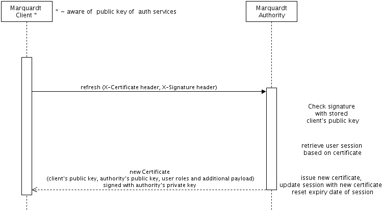

# Marquardt Java SDK
[](https://travis-ci.org/echocat/marquardt-java-sdk)
[](https://coveralls.io/github/echocat/marquardt-java-sdk?branch=master)
[](https://www.versioneye.com/user/projects/55f2c1ced4d2040019000161)
[](http://mozilla.org/MPL/2.0/)

_echocat Marquardt_ is a certificate based distributed authentication / authorization framework. 

It uses a central __authority__ which holds the session of a user. The authority produces certificates which are signed using a key pair with a public key trusted by Marquardt services and clients. Certificates have a short time to live of ~ 15 minutes. When they are expired, they must be refreshed.

__Clients__ communicate with the authority to obtain a certificate. They can use the certificate to read the roles of a user to allow access to client features and to get basic user information for presentation. They also use the certificate to access protected services.

__Services__ can authenticate and authorize client requests without roundtrips to the central authority. They read the certificate from the request header and check the requests are also signed by the client (whose public key is contained in the certificate). They use embedded payload from the certificate to access necessary user information.

### Marquardt Sign In Process

In order to access protected services, a client must obtain a certificate issued by the authority. The following diagram explains the basic process: A client sends its credentials to the authority. The authority checks that the user exists and its credentials are valid, creates a new session if necessary and issues the certificate. 


### Marquardt Refresh Process

Certificates expire after ~15 minutes and need to be refreshed by the client:



### Marquardt Sign Out Process

To log out, a client must send it's current certificate - also expired ones - to the authority sign out endpoint:


## Modules

### Authority
[](https://www.versioneye.com/user/projects/55f2c44ad4d204001c00011d)

### Client
[](https://www.versioneye.com/user/projects/55f2c431d4d204001c000118)

### Service
[](https://www.versioneye.com/user/projects/55f2c432d4d204001e0000c7)

### Common
[](https://www.versioneye.com/user/projects/55f2c543d4d2040019000197)

### Example
[](https://www.versioneye.com/user/projects/55f2c431d4d2040019000185)

## How to Contribute

Please activate the provided pre-commit hook to ensure no files without license information are committed. To activate the hook, please run:

```
cd .git_hooks
./enable_hooks.sh
```

## Credits

[](https://teufelaudio.com) [](https://raumfeld.com)

Development of this project is sponsored by [Lautsprecher Teufel GmbH](https://teufelaudio.com) and is used in their [Raumfeld products](https://raumfeld.com). 


## License

This Source Code Form is subject to the terms of the Mozilla Public
License, v. 2.0. If a copy of the MPL was not distributed with this
file, You can obtain one at http://mozilla.org/MPL/2.0/.

